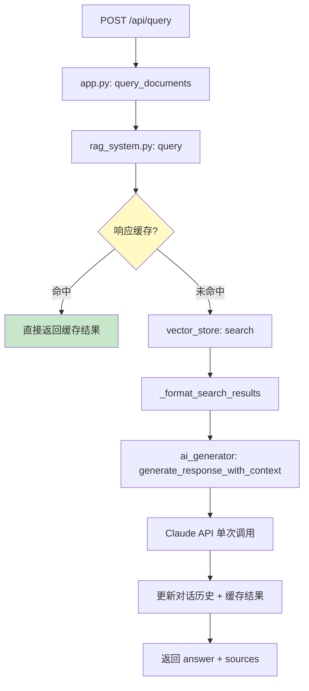
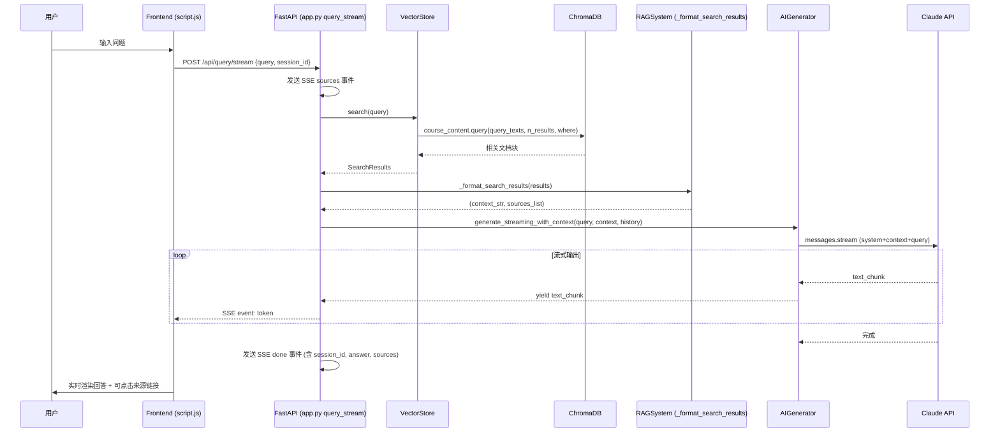
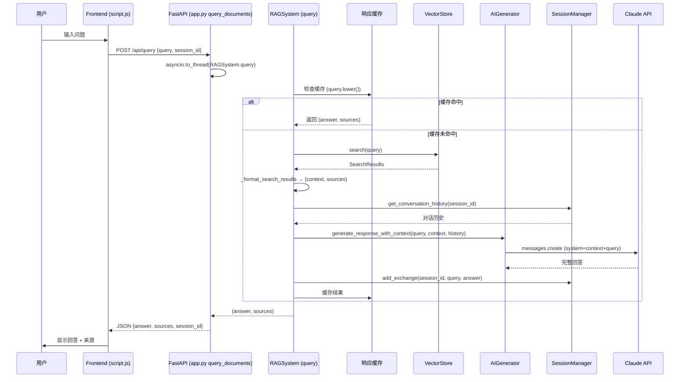
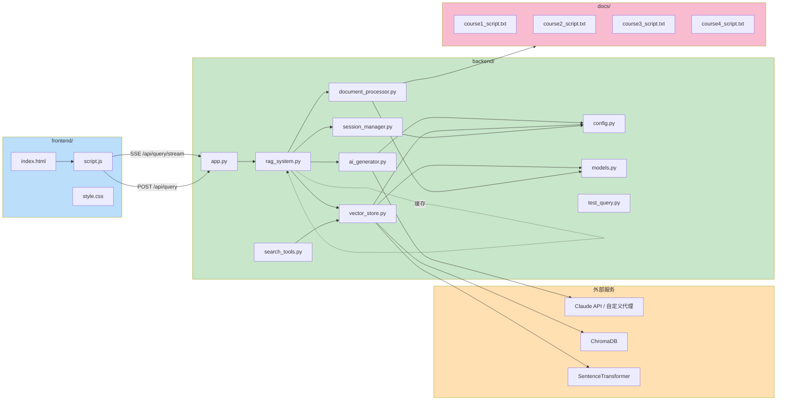
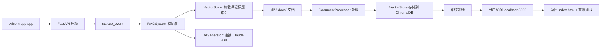

# RAG 系统请求流程图

## 整体架构流程

```mermaid
flowchart TD
    subgraph Frontend["前端 (frontend/)"]
        A[用户输入问题] --> B[script.js: sendMessage]
        B --> C[POST /api/query/stream (SSE)]
    end

    subgraph Backend["后端 (backend/)"]
        D[app.py: query_stream] --> E[vector_store.py: search]
        E --> F[ChromaDB 语义搜索]
        F --> G[返回相关文档]
        G --> H[rag_system.py: _format_search_results]
        H --> I[格式化 context + sources]
        I --> J[ai_generator.py: generate_response_with_context]
        J --> K{流式输出}
        K -->|token| L[SSE event: token]
        K -->|完成| M[SSE event: done]
        K -->|异常| N[SSE event: error]
    end

    C --> D
    L --> O[前端实时更新回答]
    M --> P[显示来源 Sources]
    N --> Q[显示错误信息]

    style Frontend fill:#e1f5fe
    style Backend fill:#fff3e0
```

## 非流式备用流程



## 数据流详解

### 流式查询（主路径）



### 非流式查询（备用路径）



## 文件关系图



## 启动流程



## 关键架构变更说明

| 变更 | 原实现 | 新实现 |
|------|--------|--------|
| 查询方式 | Tool-use 循环 (2次API调用) | 预搜索 + 单次API调用 |
| 前端请求 | POST /api/query (同步) | POST /api/query/stream (SSE流式) |
| 响应缓存 | 无 | RAGSystem 内置 LRU 缓存 |
| 来源链接 | 纯文本 | `|||` 分隔嵌入URL，前端渲染为可点击链接 |
| 课程名解析 | 纯向量搜索 | 精确匹配 → 子串匹配 → 向量搜索 (三级) |
| 自定义代理 | 不支持 | config.py 支持 ANTHROPIC_BASE_URL |
| 流式异常处理 | HTTP 500 | SSE error 事件 |
