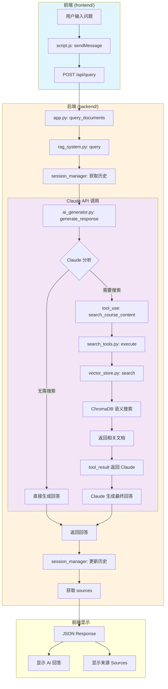
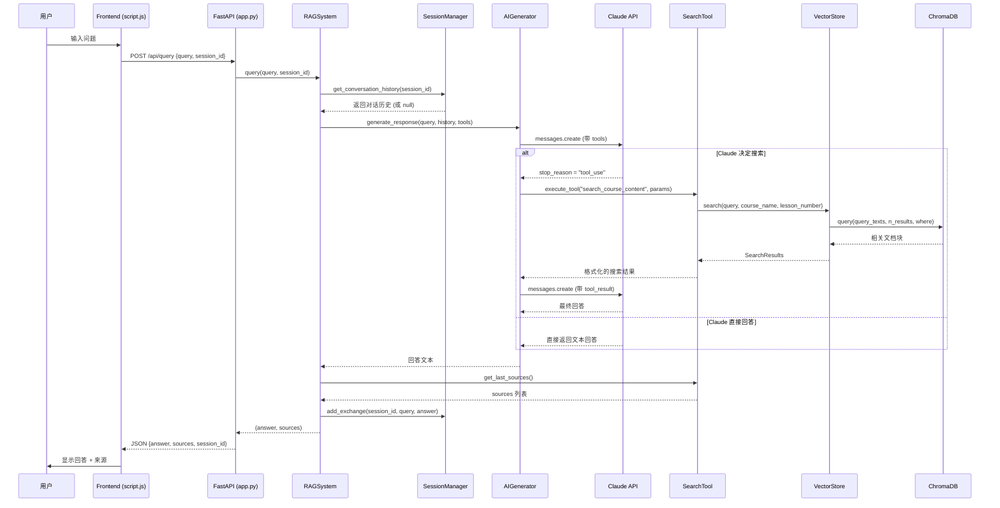
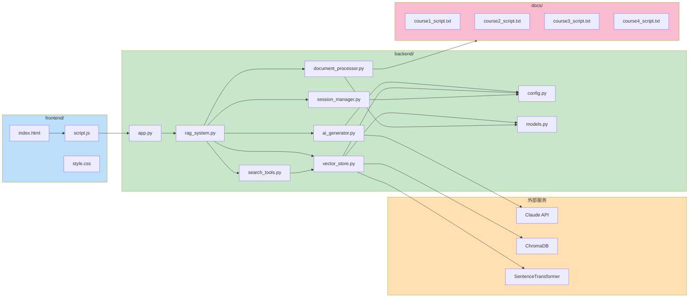

# RAG 系统请求流程图

## 整体架构流程

```mermaid
flowchart TD
    subgraph Frontend["前端 (frontend/)"]
        A[用户输入问题] --> B[script.js: sendMessage]
        B --> C[POST /api/query]
    end

    subgraph Backend["后端 (backend/)"]
        D[app.py: query_documents] --> E[rag_system.py: query]
        E --> F[session_manager: 获取历史]
        F --> G[ai_generator.py: generate_response]
        
        subgraph Claude["Claude API 调用"]
            G --> H{Claude 分析}
            H -->|需要搜索| I[tool_use: search_course_content]
            H -->|无需搜索| J[直接生成回答]
            
            I --> K[search_tools.py: execute]
            K --> L[vector_store.py: search]
            L --> M[ChromaDB 语义搜索]
            M --> N[返回相关文档]
            N --> O[tool_result 返回 Claude]
            O --> P[Claude 生成最终回答]
        end
        
        J --> Q[返回回答]
        P --> Q
        Q --> R[session_manager: 更新历史]
        R --> S[获取 sources]
    end

    C --> D
    S --> T[JSON Response]
    
    subgraph Frontend2["前端显示"]
        T --> U[显示 AI 回答]
        T --> V[显示来源 Sources]
    end

    style Frontend fill:#e1f5fe
    style Backend fill:#fff3e0
    style Claude fill:#f3e5f5
```

## 数据流详解

```mermaid
sequenceDiagram
    participant U as 用户
    participant F as Frontend (script.js)
    participant API as FastAPI (app.py)
    participant RAG as RAGSystem
    participant SM as SessionManager
    participant AI as AIGenerator
    participant Claude as Claude API
    participant Tool as SearchTool
    participant VS as VectorStore
    participant DB as ChromaDB

    U->>F: 输入问题
    F->>API: POST /api/query {query, session_id}
    API->>RAG: query(query, session_id)
    
    RAG->>SM: get_conversation_history(session_id)
    SM-->>RAG: 返回对话历史 (或 null)
    
    RAG->>AI: generate_response(query, history, tools)
    AI->>Claude: messages.create (带 tools)
    
    alt Claude 决定搜索
        Claude-->>AI: stop_reason = "tool_use"
        AI->>Tool: execute_tool("search_course_content", params)
        Tool->>VS: search(query, course_name, lesson_number)
        VS->>DB: query(query_texts, n_results, where)
        DB-->>VS: 相关文档块
        VS-->>Tool: SearchResults
        Tool-->>AI: 格式化的搜索结果
        AI->>Claude: messages.create (带 tool_result)
        Claude-->>AI: 最终回答
    else Claude 直接回答
        Claude-->>AI: 直接返回文本回答
    end
    
    AI-->>RAG: 回答文本
    RAG->>Tool: get_last_sources()
    Tool-->>RAG: sources 列表
    RAG->>SM: add_exchange(session_id, query, answer)
    
    RAG-->>API: (answer, sources)
    API-->>F: JSON {answer, sources, session_id}
    F->>U: 显示回答 + 来源
```

## 文件关系图

```mermaid
graph LR
    subgraph frontend["frontend/"]
        HTML[index.html]
        JS[script.js]
        CSS[style.css]
    end

    subgraph backend["backend/"]
        APP[app.py]
        RAG[rag_system.py]
        AI[ai_generator.py]
        VS[vector_store.py]
        DP[document_processor.py]
        ST[search_tools.py]
        SM[session_manager.py]
        CFG[config.py]
        MDL[models.py]
    end

    subgraph external["外部服务"]
        CLAude[Claude API]
        CHROMA[ChromaDB]
        ST2[SentenceTransformer]
    end

    subgraph docs["docs/"]
        C1[course1_script.txt]
        C2[course2_script.txt]
        C3[course3_script.txt]
        C4[course4_script.txt]
    end

    HTML --> JS
    JS --> APP
    
    APP --> RAG
    RAG --> AI
    RAG --> VS
    RAG --> SM
    RAG --> ST
    RAG --> DP
    
    AI --> CFG
    AI --> CLAude
    
    VS --> CFG
    VS --> MDL
    VS --> CHROMA
    VS --> ST2
    
    ST --> VS
    DP --> MDL
    SM --> CFG
    
    DP --> docs

    style frontend fill:#bbdefb
    style backend fill:#c8e6c9
    style external fill:#ffe0b2
    style docs fill:#f8bbd0
```

## 启动流程

```mermaid
flowchart LR
    A[run.sh] --> B[uvicorn app:app]
    B --> C[FastAPI 启动]
    C --> D[startup_event]
    D --> E[RAGSystem 初始化]
    E --> F[加载 docs/ 文档]
    F --> G[DocumentProcessor 处理]
    G --> H[VectorStore 存储]
    H --> I[系统就绪]
    
    I --> J[用户访问 localhost:8000]
    J --> K[返回 index.html]
```